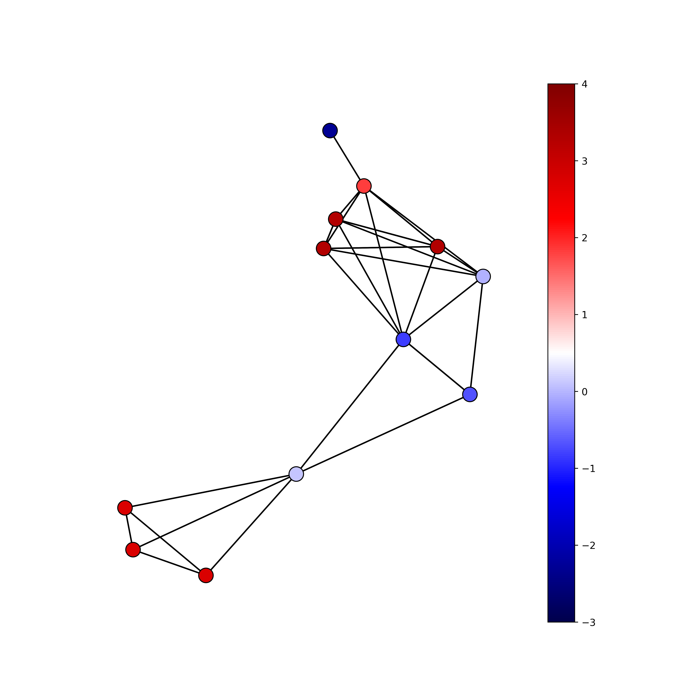
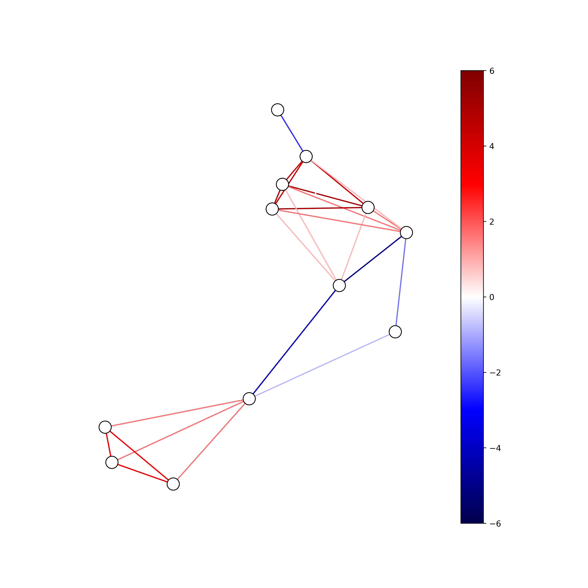
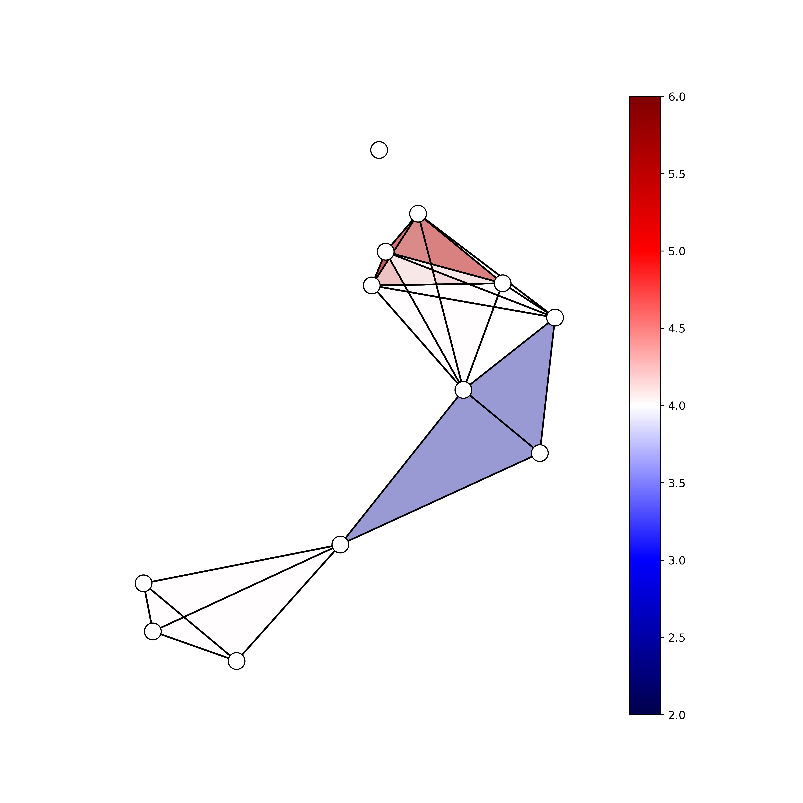

=============================================================================================
pynetflow : Python network Ricci curvature and flow
=============================================================================================
.. image:: https://github.com/anthbapt/pynetflow/workflows/CI/badge.svg
    :target: https://github.com/anthbapt/pynetflow/actions?query=branch%3Amaster+workflow%3ACI
 
This repository contains the Python package called pynetflow, which enables the computation of Ricci curvature and Ricci flow. It also provides visualization capabilities for the network and its curvature throughout the flow process. Additionally, it implements a function to compute Ricci curvature on simplicial complexes and visualize the curvature of various cells based on their order.

.. image:: pynetflow_logo.png
   :width: 200

-----------------
 Installation
-----------------

                                
.. code-block:: bash    

  $ python setup.py install

         
-----------------
 Library Codes
-----------------

* ``ricci_curvature.py`` : 
* ``ricci_flow.py`` :
* ``ricci_vis.py`` : 

-----------------
Data
-----------------

``toy_network.csv`` : Adjacency matrix for a small network with a single connected component of 44 nodes

``toy_data.csv`` : A data matrix of 10 columns (samples) and 44 rows (each corresponding to e.g. gene expression of a node of the above adj mat)

-----------------
Usage
-----------------

Ricci curvature and visualisation
-----------------

.. code-block:: python

    SC = xgi.SimplicialComplex()
    SC.add_simplices_from([[3, 4, 5], [3, 5, 6], [6, 7, 8, 9], [1, 4, 10, 11, 2], [1, 3, 10, 11, 2], [1, 0]])
    pos = xgi.barycenter_spring_layout(SC)
    
    # For visualise only the curvature of nodes (order = 0)
    visualize_order(SC, 0)
    
    

   
   
.. code-block:: python

    # For visualise only the curvature of edges (order = 1)
    visualize_order(SC, 1)
    
    

    
.. code-block:: python

    # For visualise only the curvature of triangles (order = 2)
    visualize_order(SC, 2)
    

   

Ricci flow
-----------------
After having checked and/or modified the script parameters in accordance to your data, set the desired number of iterations and run the following Python code : 

.. code-block:: python

    from ricci_flow import drop_weights, Forman_ricci, Signal_entropy, dist_mat
    from ricci_flow import RicciFlow_normalised, Total_ricci_curvature

    adj = pd.read_csv('data/toy_network.csv', index_col = 0)
    adj.columns = list(adj.index)
    G = nx.from_pandas_adjacency(adj)
    drop_weights(G)
    vec = pd.read_csv('data/toy_data.csv', index_col = 0)

    ve_init = np.array(vec['V5'])
    ve_final = np.array(vec['V7'])
    eta = 0.5
    n_iter = 20
    
    ricciflow = RicciFlow_normalised(G, ve_init, ve_final, Niter = n_iter, eta = eta)

