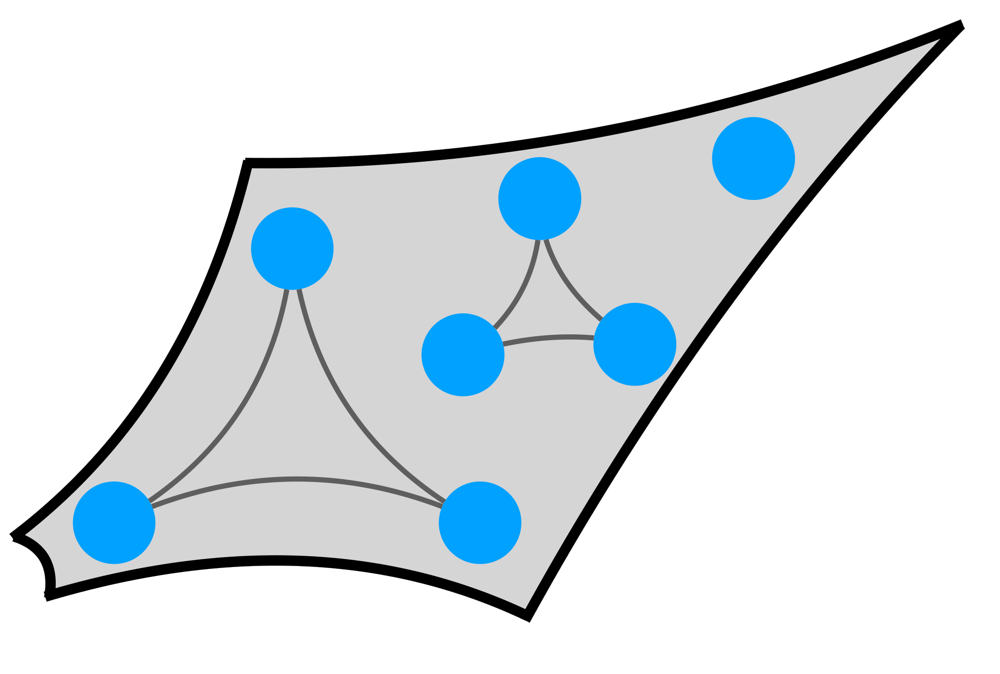

=============================================================================================
pynetflow : Python network Ricci curvature and flow
=============================================================================================

.. image:: https://github.com/anthbapt/pynetflow/workflows/CI/badge.svg
    :target: https://github.com/anthbapt/pynetflow/actions?query=branch%3Amaster+workflow%3ACI
 
This repository contains an algorithm for Ricci curvature and Ricci flow.

-----------------
 Installation
-----------------

                                
.. code-block:: bash    

  $ python setup.py install

         
-----------------
 Library Codes
-----------------

* ``ricci_curvature.py`` : 
* ``ricci_flow.py`` :
* ``ricci_vis.py`` : 

-----------------
Data
-----------------

``toy_data.csv`` : 

``toy_network.csv`` :

-----------------
Usage
-----------------

After having checked and/or modified the script parameters in accordance to your data, set the desired number of iterations and run the following Python code : 

.. code-block:: python

    from ricci_flow import drop_weights, Forman_ricci, Signal_entropy, dist_mat
    from ricci_flow import RicciFlow_normalised, Total_ricci_curvature

    adj = pd.read_csv('data/toy_network.csv', index_col = 0)
    adj.columns = list(adj.index)
    G = nx.from_pandas_adjacency(adj)
    drop_weights(G)
    vec = pd.read_csv('data/toy_data.csv', index_col = 0)

    ve_init = np.array(vec['V5'])
    ve_final = np.array(vec['V7'])
    eta = 0.5
    n_iter = 20
    
    ricciflow = RicciFlow_normalised(G, ve_init, ve_final, Niter = n_iter, eta = eta)

